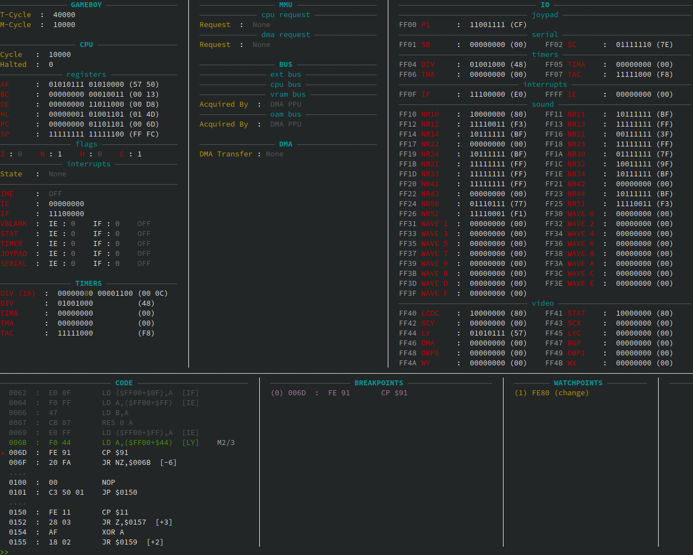

## TUI

**T**erminal **U**ser **I**nterface is a C++17 library that offers a minimal support for creating composable layouts for terminal interfaces.

This has been made to create friendly interface for the Debugger of [Docboy](https://github.com/Docheinstein/docboy/) (GameBoy emulator).

### Components

* Blocks of text
* Horizontal Layouts
* Vertical Layouts
* Horizontal dividers
* Vertical dividers

Also: colors!
### Example

In you can find an usage example in `main.cpp`.

An minimal example:

```cpp
using namespace Tui;

auto b1{make_block()};
b1 << "111" << endl;
b1 << "111" << endl;

auto b2{make_block()};
b2 << "22" << endl;
b2 << "22" << endl;

auto b3{make_block()};
b3 << red("333333") << endl;

auto h1{make_horizontal_layout()};
h1->addNode(std::move(b1));
h1->addNode(make_divider("|"));
h1->addNode(std::move(b2));

auto v1{make_vertical_layout()};
v1->addNode(std::move(h1));
v1->addNode(make_divider("-"));
v1->addNode(std::move(b3));

Presenter p {std::cout};
p.present(*v1);
```
Which produces:

```
111|22
111|22
------
333333
```

But with a bit more effort you can obtain something like this:



### Usage

To use TUI as a static library with CMake, copy it or add it as a submodule,
then add to your `CMakeLists.txt`:

```
add_executable(my-awesome-project STATIC)

...

add_subdirectory(tui)

target_link_libraries(my-awesome-project PRIVATE tui)
```